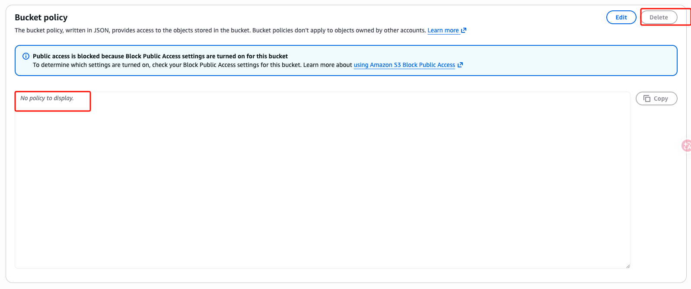

# 以下為 aws vpn-endpoint 流程

設定完成後僅能透過 vpc 網路去連線該 s3 bucket, 目前我們就透過 ec2 達成這個條件

由於設定s3 policy 後使用 AWS console admin 帳號也無法上傳圖片，所以我先刪除policy後上傳了一張 demo image

進入vpc 中的 ec2 主機中

因為我在 terraform 中有設定 `admin_principal_arn`，所以一定要登入才可以查看 s3 bucket的內容

使用aws console 無法查看該 bucket 的內容

再沒有使用 VPC 網路的情況下是無法連線到 s3 bucket, 包刮 admin 帳號
